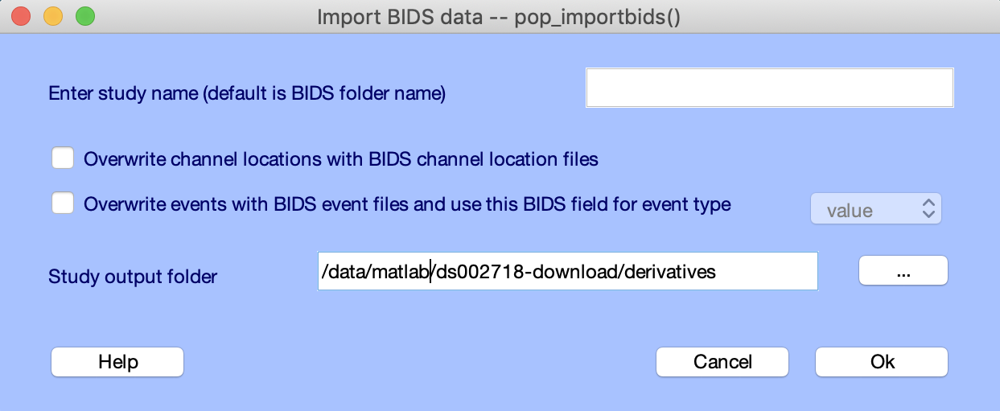

# Export datasets to BIDS

Because there is so much meta-data in BIDS, exporting a collection of dataset to BIDS is currently best done from the command line. An documented example script ''bids_export_example.m'' is provided. You may modify this script for your own purpose. A menu ''To BIDS folder structure'' is available for EEGLAB studies but EEGLAB will not be able to provide important meta-data it does not have access to (such as Authors of the study and other data information). A comprehensive export graphic interface is in development.

# Import datasets from BIDS to EEGLAB study

The EEGLAB menu to import a BIDS dataset into an EEGLAB study is fully functional. A screen capture is shown below.

Raw raw EEG data file often has events. However, BIDS also define events in dedicated event files. Sometimes the BIDS event files contain more information than the raw EEG data file. In that case, users may choose to overwrite raw EEG data events with the event information contained in the BIDS event files.

Similarly raw EEG data files often define channel labels. However, BIDS also define channel labels and channel locations in dedicated event files. By pressing the second checkbox, users may choose to use the channel label and location information contained in the BIDS channel definition files.

Finally, user may select an output folder for storing their EEGLAB STUDY. If a folder is not selected, EEGLAB will store STUDY files ''in place'' which means in the BIDS folder structure - resulting in the BIDS folder becoming non-BIDS compliant and failing to pass BIDS validation because of the additional EEGLAB files.
